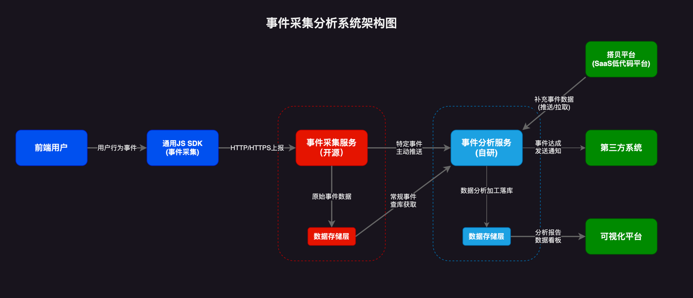

# 事件采集分析应用设计说明

结合现有的搭贝服务，计划新增两个核心服务：事件采集服务（可选开源或自研）+ 事件分析服务（自研），与搭贝服务共同构成完整的事件采集分析体系。

如果事件采集服务采用自研方案，可将事件采集服务与事件分析服务合并为一个综合服务，以减少服务数量，降低系统复杂度，便于统一管理。

本文档暂按《事件采集服务 + 事件分析服务 + 搭贝》的架构模式进行详细说明。

## 事件采集服务

事件采集服务负责前端用户行为数据的收集和初步处理，主要包含以下组件：

### 通用JS SDK
- 对基础用户事件（如点击、浏览、滚动等）和业务自定义事件进行统一封装
- 提供标准化的事件采集API接口
- 通过HTTP/HTTPS协议将采集到的事件数据上报至后台服务

### 后台服务组件
- 提供统一的事件接收接口，支持高并发数据接入
- 对上报事件进行基础数据校验、去重和过滤处理
- 支持将特定事件或订阅事件实时推送至第三方服务系统
- 实现事件数据的初步聚合和缓存机制

### 数据存储层
- 持久化存储原始事件数据
- 采用按年、季度或月份的分表策略，确保大数据量下的查询性能
- 支持数据归档和清理机制，控制存储成本

## 事件分析服务

事件分析服务是整个系统的核心分析引擎，主要功能包括：

- **数据接收**：统一接收来自事件采集服务和搭贝平台的事件数据
- **数据处理**：对多源事件数据进行解析、清洗、整合和关联分析
- **报告生成**：基于业务需求生成多维度事件分析报告
- **结果推送**：将分析结果以可视化报告、数据看板等形式推送给终端用户
- **实时监控**：提供实时事件监控和异常预警功能

## 搭贝平台

搭贝作为SaaS化的低代码应用平台，是事件采集分析的主要目标对象：
除了作为事件采集对象外，还需将事件采集服务采集不到的数据推送（或提供接口以供拉取）给事件分析服务，配合事件采集数据进行事件分析，完成业务功能